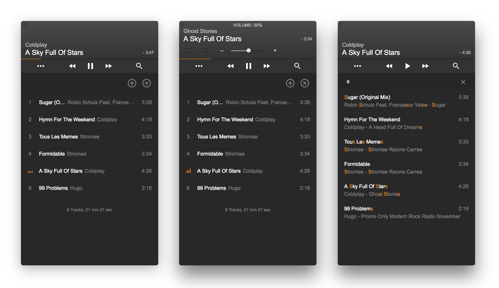

# Audio player VOX

[](https://travis-ci.org/fresk-nc/VOX)

This project is naive implementation of the famous player [VOX](https://coppertino.com/).
It is with the aim to learn the [Electron](http://electron.atom.io/).



## Download

Only [MacOS](https://github.com/fresk-nc/VOX/releases)

## How to develop
### Run

Run this two commands **simultaneously** in different console tabs:

```
$ npm run server
$ npm run start:hot
```

or run with one command:

```
$ npm run dev
```

### Tests and linter

For unit tests:
```
$ npm run test
```
or
```
$ npm run test:watch
```

For linter:
```
$ npm run lint
```
### Package

```
$ npm run package
```

## License
MIT